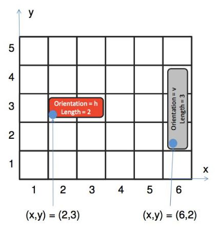
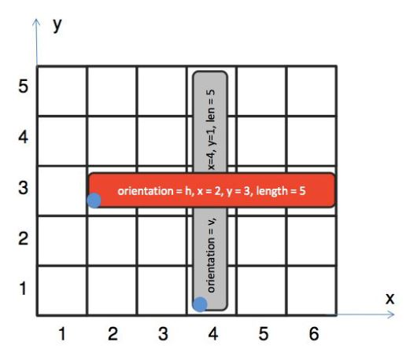

# Blocks

## Instructions
> First, watch the video: http://www.youtube.com/watch?v=GuRt9OuNblI&feature=related 

A block: 
- is always rectangular 
- has an id (0-based) 
- has a position (x, y) in the matrix defined by the left bottom corner (= blue circle) of the block - has a length 
- has a width, which is always one

A block‘s orientation is either vertical („v“) or horizontal („h“). You can move:
- vertical blocks only vertically: up (positive number) or down (negative number)
- horizontal blocks only horizontally: right (positive number) or left (negative number)

## Do two blocks overlap? 
1. 
* Input: block1 block2 
    * block1 = id orientation x y length 
    * block2 = id orientation x y length 

    * Block: 
        - id: unique id of the block 
        - orientation: “h“ (horizontal) or “v“ (vertical) 
        - x: x-coordinate of bottom left 
        - y: y-coordinate of bottom left 
        - length: length of the block 

2. 
* Output: true ... when the blocks overlap false ... otherwise. 

3. 
* Example: 
    - Input: 0 h 2 3 5 1 v 4 1 5
    - Output: true

## Challenge
Write and application to find out the output of the following inputs:

1. 0 h 2 3 5 1 v 3 1 1 
2. 0 h 2 3 1 1 h 2 3 1 
3. 0 h 2 3 5 1 h 3 3 2 
4. 0 h 2 3 5 1 h 4 1 2 
5. 0 h 2 3 5 1 v 3 1 3 
6. 0 h 8 7 2 1 v 10 7 6 
7. 0 h 2 3 5 1 v 3 1 2 
8. 0 h 4 3 3 2 v 6 2 2 
9. 0 v 3 3 2 1 v 3 5 2 
10. 0 h 1 3 2 1 h 5 3 2 

Try to use different classes to model the different entities implied in the solution. You can use a programming language of your choice (we prefer PHP) or even a pseudo-language.